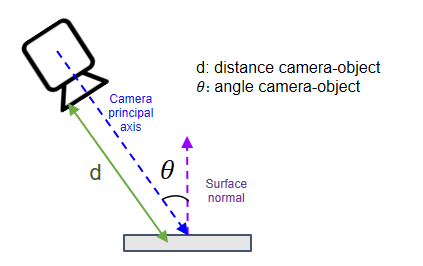

# Calculating Distances and Angles of Observation using Aruco Markers

Automated calculation of distances and angles using Aruco Markers and image processing in 2 steps: 
   
 1. Camera Calibration.
 2. Detection of markers.

 

<!--
(Spanish)   Calculo automático de distancias usando imágenes con Aruco Markers.
-->

## References:

- [Camera calibration using CHARUCO](https://mecaruco2.readthedocs.io/en/latest/notebooks_rst/Aruco/sandbox/ludovic/aruco_calibration_rotation.html)
